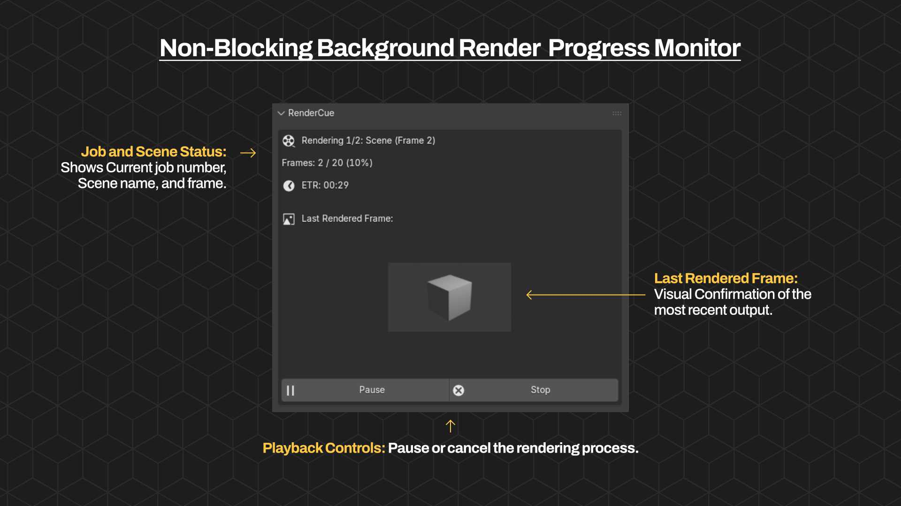

# RenderCue

**Sequence. Queue. Render.**

RenderCue is a powerful Blender add-on that bridges the gap between Scene Management and Batch Rendering. It provides a streamlined visual interface to queue multiple scenes, override their output settings per-job, and execute renders in the background while keeping your UI responsive.

## 🚀 Features

- **Global Render Queue**: Add scenes from anywhere in your .blend file to a centralized queue.
- **Batch Rendering**: Render all queued scenes in one go with a single click.
- **Background Rendering**: Renders are performed in the background, keeping Blender responsive.
- **Pause/Resume**: Pause renders at any time and resume them later.
- **Smart Overrides**:
  - **Output Path**: Set a global output folder or override per job.
  - **Frame Range**: Render specific frame ranges for each job.
  - **Resolution**: Quickly scale resolution (e.g., 50% for drafts).
  - **Render Engine**: Switch between Cycles, Eevee, and Workbench per job.
  - **View Layer**: Select specific view layers to render.
  - **Cameras**: Override the active camera for any job.
- **Presets**: Save and load queue configurations, or use quick "Draft"/"Production" presets.
- **Notifications**: Get notified via system toasts or webhooks when your batch render completes.

## 📦 Installation

1. **Download** the latest release zip file.
2. Open Blender and go to **Edit > Preferences > Add-ons**.
3. Click **Install...**, select the zip file, and enable **Render: RenderCue**.

> [!NOTE]
> RenderCue is compatible with Blender 3.0 through 5.0+.

## 🎮 Quick Start Guide

### 1. Building the Queue

- Open the **RenderCue** panel in the **Render Properties** tab or the **3D Viewport N-Panel**.
- Click **Add Scene** to add the current scene, or **Add All Scenes** to populate the queue with all scenes in the file.
- Reorder jobs using the up/down arrows.

### 2. Configuring Jobs

- Use the **Batch Settings** box to set a global output path.
- Expand the **Overrides** section for any job to set specific settings:
  - **Output**: Custom output path for this job.
  - **Frame Range**: Override the scene's frame range.
  - **Resolution %**: Scale the render resolution.
  - **Format**: Change the file format (PNG, JPEG, etc.).
  - **Samples**: Override render samples.
  - **Engine**: Switch render engine (Cycles/Eevee).
- **Tip**: Click the duplicate icon (⧉) next to an override to apply that setting to **ALL** jobs in the queue.

### 3. Rendering

- Click **Render Cue** to start the batch process.
- Monitor progress in the panel or the status bar.
- Use **Pause**, **Resume**, or **Stop** buttons to control the process.
- You can continue working in Blender while rendering (rendering happens in the background).

## 💡 Common Use Cases

### Multi-Camera Rendering

Create multiple linked scenes (or use the same scene) and add them to the queue. For each job, use the **Camera Override** to select a different camera. This allows you to batch render multiple angles of the same subject in one go.

### Draft vs. Final Renders

Use the **Presets** menu to quickly switch between quality settings.

- **Draft**: 50% resolution, low samples, Eevee or Workbench engine.
- **Production**: 100% resolution, high samples, Cycles engine.

### Distributed Rendering Preparation

Split a long animation into multiple jobs with different frame ranges (e.g., Frames 1-100, 101-200). This is useful for managing long renders or distributing work across multiple machines manually.

## ❓ Troubleshooting

### Panel is empty or addon won't load

- **Check the System Console**: In Blender, go to **Window > Toggle System Console**.
- Look for Python errors. A common issue is "blender_manifest.toml" errors in older Blender versions (ensure you are using the correct zip).

### Buttons not visible

- Make sure you have at least **one scene added to the queue**.
- The buttons are always visible, but check if the panel is collapsed.

### "Apply to All" buttons not working

- These only work when you have multiple jobs in the queue.
- Select a job, set an override, then click the ⧉ icon.

### Thumbnails not updating

- Thumbnails update when a frame finishes rendering. If using OpenEXR Multilayer, thumbnails might not generate due to format limitations in Blender's preview API.

## 🤝 Support & Contributing

If you find this tool useful, consider supporting its development:
[**Support on Patreon**](https://www.patreon.com/c/usamasq)

### Reporting Issues

If you encounter a bug, please open an issue on GitHub with:

- Blender version
- OS version
- Steps to reproduce
- Error logs (from System Console)

### Contributing

We welcome contributions! Please see [CONTRIBUTING.md](CONTRIBUTING.md) for guidelines on how to get started.

## License

GPL v3
