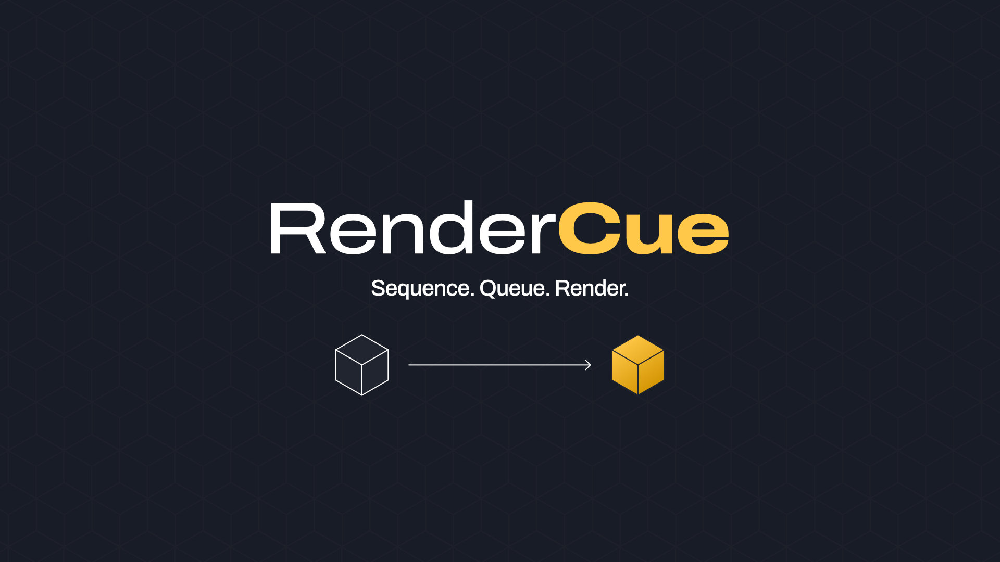

# RenderCue

**Sequence. Queue. Render.**

RenderCue is the ultimate batch rendering solution for Blender, designed to bridge the gap between Scene Management and background execution. It provides a streamlined, professional interface to queue multiple scenes, override their settings per-job, and execute renders in the background—keeping your UI responsive so you can keep working.

Built for modern pipelines, RenderCue fully supports **Blender 4.2 LTS through 5.0+**.

## 🚀 Features

- **Global Render Queue**: Add scenes from anywhere in your .blend file to a centralized, reorderable queue.
- **True Background Rendering**: Renders are performed in a separate background process, keeping Blender completely responsive.
- **Queue Health System**: Automatically validates your queue for errors (missing cameras, invalid paths) before you start, preventing wasted render time.
- **Smart Overrides**: Instantly override settings per job without changing your scene data. Organized into collapsible sections:
  - **Output Settings**: Custom Output Path, Camera, Transparent Background, and Compositor toggle.
  - **Range & Resolution**: Frame Range (Start/End), Frame Step, and Resolution Scale %.
  - **Format**: Change file format (PNG, EXR, JPEG, etc.) per job.
  - **Render Engine**: Switch between Cycles, Eevee, and Workbench.
  - **Quality**: Override Samples and Cycles-specific settings (Denoising, Device, Time Limit, Persistent Data).
- **Pause & Resume**: Pause renders at any time. **New:** You can now even close Blender and resume your render queue later from where it left off.
- **Presets System**: Save your entire queue configuration to a JSON file to load later, or share between files.
- **Notifications**:
  - **Desktop Toasts**: Native Windows notifications when jobs complete.
  - **Webhooks**: Send completion reports to your Discord or Slack channels.
- **Detailed Summary**: View a comprehensive report of render times, successful frames, and errors upon completion.

## 📦 Installation

1.  Download the latest release zip file.
2.  Open Blender.
3.  Go to **Edit > Preferences > Add-ons**.
4.  Click **Install...** and select the zip file.
5.  Enable the addon by checking the box next to **Render: RenderCue**.

## 🎮 Usage

### 1. Building the Queue

- Open the **RenderCue** panel in the Render Properties tab or N-Panel.
- Click **Add Scene** or **Add All Scenes** to populate your queue.
- **Queue Health**: Check the panel below the list for any warnings or errors (marked in red/orange).

### 2. Configuring Jobs

- **Global Output**: Use the "Global Output" section to set a base folder for all jobs.
- **Overrides**: Select a job and expand the **Overrides** section.
  - Enable specific overrides like **Resolution**, **Frame Range**, or **Camera**.
  - **Tip**: Use the "Apply to All" button (⧉) next to any setting to instantly propagate it to every job in the queue.

### 3. Rendering

- Click **Render Cue** to start.
- Monitor progress via the **Rendering in Progress** panel, which shows:
  - Job progress (e.g., "Job 1/5")
  - Time Remaining (ETR)
  - **Live Preview**: A thumbnail of the last rendered frame.
  - **Queue Status**: A mini-view of upcoming jobs.
- You can continue working in Blender while your renders churn in the background!

## Support

If you find this tool useful, consider supporting its development.

## License

**GPL v3**
